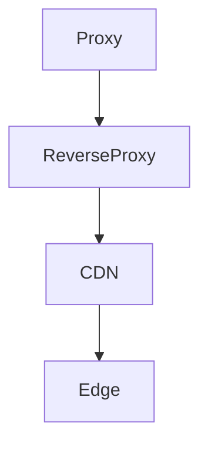

# UI・可視化仕様

## 1. 基本レイアウト

ユーザー提示イメージに近い 3 ペインを基本とする。

```text
┌────────────┬────────────────────────────┬─────────────────────────────┐
│ Navigation │ Reader                     │ Chat / Insight detail       │
│            │                            │                             │
│ Outline    │ PDF page                   │ Source cards                │
│ Search     │ Text selection             │ Answer                      │
│ Deep Dive  │ Temporary highlight        │ Visualization               │
│ Insights   │                            │ Composer / Artifact detail  │
└────────────┴────────────────────────────┴─────────────────────────────┘
```

### 左ペイン

- 本のタイトル
- Outline / 目次
- ページ番号
- PDF 内検索
- 過去の Deep Dive
- Insight Library

### 中央ペイン

- PDF ページ
- 1ページ表示を既定とする
- 連続スクロールへ切替可能
- 拡大縮小
- 幅に合わせる（ペインresize・ページ変更へ自動追従）
- テキスト選択
- AI 回答・Insight の引用クリック時の一時ハイライト

### 右ペイン

通常は現在の Deep Dive Chat を表示する。

Insight を選択した場合は同じ領域を Insight Detail として利用できる。

- 現在のチャットスレッド
- 添付中 Source Anchor
- AI が追加参照した Source Anchor
- ユーザー質問
- AI 回答
- Mermaid / Visualization
- 新規スレッド、スレッド一覧
- Insight の詳細・編集・version

---

## 2. 選択 UX

本文選択後、選択範囲の近くに Floating Action を表示する。

```text
[ 深掘り ] [ 引用に追加 ]
```

### 深掘り

- 新しいチャットスレッドを開始する、または現在スレッドへ引用を追加する。
- 右ペインを自動表示する。
- Source Card を生成する。

### 引用に追加

- 現在の質問へ Source Anchor だけ追加する。
- 追加後も PDF 読書を継続できる。

複数選択をした後にまとめて質問できることを重視する。

参照数に意味的な固定上限は設けず Context Budget で制御する。

---

## 3. Source Card

```text
┌────────────────────────────────────────────┐
│ p.80  Cloudflare Workers とエッジ          │
│                                            │
│ 「そこで、筆者はエッジのことを……」         │
│                                            │
│ [本文へ移動] [×]                           │
└────────────────────────────────────────────┘
```

カード内では長文を省略するが、展開可能にする。

AI に送信済みの Source Card は Turn 履歴の一部として immutable に扱う。

### 3.1 User-selected と AI-expanded

明示選択と AI の追加探索を視覚的に区別する。

```text
Sources

Selected by you
  p.80
  p.83

Added by AI
  p.84   nearby context
  p.126  search: "edge runtime"
```

AI-expanded source は、どの操作で取得されたかを表示できるようにする。

- 前後文脈
- Section 読込
- 書籍内検索

---

## 4. 引用表示

回答本文では次のように UI 表現する。

```text
CDN は主に配信・キャッシュを地理分散させる考え方であり、
エッジはその場所でコード実行まで行う概念として説明されています。 [p.80]
```

内部データ上は `S1` 等を保持し、画面上では印刷ページラベルが利用可能ならそれを優先し、なければ PDF page を表示する。

クリックすると PDF を該当位置へスクロールし、保存済み rect を一時ハイライトする。

---

## 5. 回答本文フォーマット

AI 回答は Markdown を基本とする。

対応:

- 見出し
- 箇条書き
- 表
- inline code
- code block
- Source reference
- Mermaid
- Visualization Block

通常の説明本文と図解を同じ回答内で混在できるようにする。

Markdown renderer は AST ベースとし、Source reference、Mermaid、Visualization fenced block を独自 React component へ変換する。

---

## 6. Insight への保存

チャット回答は最終保存物ではない。

保存可能な回答 block に `インサイトに保存` を表示する。

```text
AI answer

説明本文 ...                  [インサイトに保存]

┌ comparison diagram ┐       [インサイトに保存]
└────────────────────┘

┌ chart ─────────────┐       [インサイトに保存]
└────────────────────┘

                              [回答全体をReportとして保存]
```

初期版では自動保存しない。

ユーザーが残すと判断したものだけ Insight Library に保存する。

---

## 7. Insight Library

左ペインから `Insights` を選ぶと、書籍に紐づく成果物を一覧する。

```text
Insights

[検索...]
[All] [Report] [Table] [Diagram] [Chart]

Chapter 3
  CDN と Edge の整理
  Reverse Proxy 比較表
  Cache API の処理フロー

Chapter 5
  Workers KV の整合性まとめ
```

filter:

- 種類
- Chapter / Section
- Page
- Tag
- 更新日時

Insight を開くと右ペインに詳細を表示する。

### Insight Detail

- Title
- Artifact kind
- content / blocks
- Source list
- origin Deep Dive
- version history
- 編集
- `このInsightを使って深掘り`

Source をクリックすると Reader に戻る。

---

## 8. Report Artifact UI

Report は Markdown だけでなく複数 block を持つ。

```text
Report: CDN と Edge

# 概要
Markdown block                 [sources: p.80, p.83]

[Comparison diagram]           [sources: p.80, p.121]

## 性能上の違い
Markdown block                 [sources: p.126]

[Chart]                        [sources: p.130]
```

各 block の source badge をクリックすると PDF へ移動できる。

---

## 9. Mermaid

AI が次を返した場合に Mermaid Renderer へ渡す。

````markdown

````

Mermaid の失敗は回答全体を壊さない。

- syntax error は図の位置にエラー表示
- 元コードを展開可能
- 「再生成」ボタン追加余地

Sequence / UML / ER / state 等は Mermaid の責務とする。

---

## 10. Visualization DSL

### 10.1 目的

Mermaid は汎用性が高い一方、比較カード、定量グラフ、タイムライン等をアプリの UI と統一して美しく表示する用途には必ずしも最適ではない。

そのため、構造化 JSON を React コンポーネントへ変換する第二の図解方式を持つ。

### 10.2 初期 component types

#### comparison

2〜4 概念の比較。

#### flow

処理フロー。`@xyflow/react` を使用する。

#### hierarchy

概念階層、分類。

#### timeline

時系列。

#### matrix

2 軸比較。

#### chart

`chartType: "bar" | "line" | "scatter"`。

Recharts を利用する。

#### callout

重要概念、定義、注意事項を視覚的に強調する。

---

## 11. Chart の根拠表示

Chart は数値の性質を明示する。

```ts
type ChartDataNature = "source" | "derived" | "illustrative";
```

- `source`: 書籍本文の値
- `derived`: 書籍の値から計算
- `illustrative`: 説明用仮想値

`illustrative` は図中に「説明用の例」等の表示を行い、実測値に見えないようにする。

Chart block も `sourceRefs` を持つ。

---

## 12. Visualization の出力制約

任意 JSX は実行しない。

AI が生成した JSON は必ず Zod Schema で parse する。

```ts
const visualizationSchema = z.discriminatedUnion("type", [
  comparisonSchema,
  flowSchema,
  hierarchySchema,
  timelineSchema,
  matrixSchema,
  chartSchema,
  calloutSchema,
]);
```

parse 失敗時は、元 JSON と検証エラーを開発者向けに保持しつつ、ユーザーには「図解を表示できませんでした」と簡潔に表示する。

---

## 13. チャット入力

入力欄上部に現在添付されている Source Anchor を横並び chip / card で表示する。

```text
[p.80 ×] [p.81 ×] [p.121 ×]

質問を入力…
                                  [送信]
```

送信前に Context Preview を開ける。

入力補助として以下をショートカット化できる。

- 詳しく説明
- 図解
- 比較
- 具体例
- 前提から説明
- コード例

ただし、主操作は自由入力とし、ボタンを増やしすぎない。

---

## 14. レスポンシブ

MVP の主対象は PC。

狭い幅では次の優先順位で折りたたむ。

1. 左 Navigation を Drawer 化
2. Reader と Chat / Insight の 2 ペイン
3. さらに狭い場合は Reader / Chat / Insight をタブ切替

最初から CSS Grid で 3 ペインを構成し、各ペイン幅をドラッグ調整可能にする。

## 11. 実装済み Rich Content 契約

Chat / Insight の出力は次の3系統だけを rich renderer に渡す。

- 通常 Markdown: `react-markdown + GFM + sanitize`
- `mermaid` fenced block: Mermaid `securityLevel: strict` で lazy render
- `visualization` / `deep-reader-viz` fenced block: JSON を `@deep-reader/visualization` の Zod schema で検証後、allow-listされた React componentへ変換

Visualization DSL の実装済み type は `comparison / flow / hierarchy / timeline / matrix / callout / chart`。Chart は `bar / line / scatter` を許可する。`sourceRefs` は `S#` 形式だけを許可し、未知の参照は UI で「要確認」と表示する。Chart は `dataNature = source | derived | illustrative` を必須とし、説明用仮想値を実測値のように見せない。

任意の JSX / JavaScript / HTML は実行しない。未知type、不正JSON、不正schema、描画例外は block 単位で安全なfallback表示へ落とす。Visualization renderer 自体も dynamic import し、React Flow / Recharts を初期 Reader bundle から分離する。
